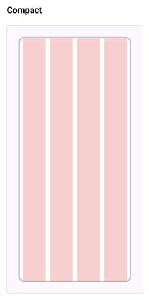
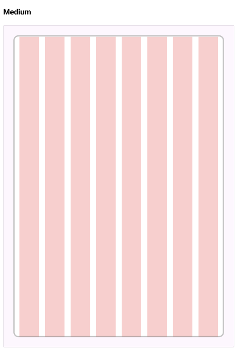
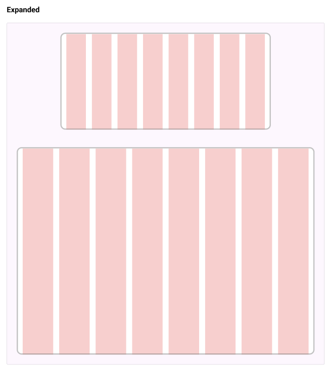
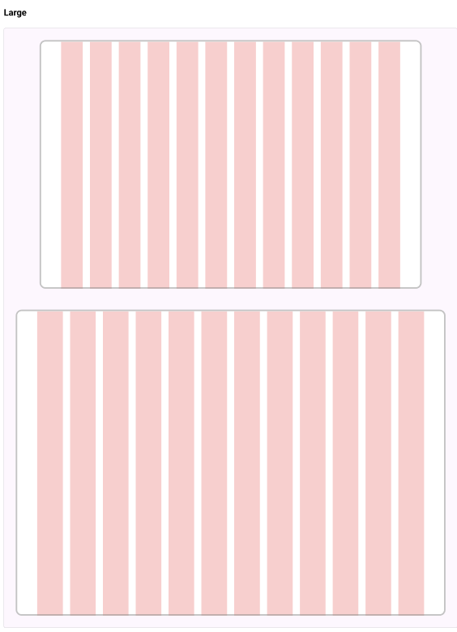

---
hide:
  - toc
---

# **Grid System**
## Class

=== "Compact"
    <div class="btn-grid-1">
        <div class="grid-items">Compact Grid (4 columns)</div>
    </div>

    ## Code

    === "HTML"
        ```{.html .copy}
        <div class="page-grid compact">
            <div class="grid-item">A</div>
            <div class="grid-item">B</div>
            <div class="grid-item">C</div>
            <div class="grid-item">D</div>
        </div>
        ```

    === "CSS"
        ```scss
        --8<-- "components/sass/layout/_grid.scss:compact"
        ```

    ## Image

    <div class="grid-example">
        
    </div>


=== "Medium"
    <div class="btn-grid-1">
        <div class="grid-items">Medium Grid (8 columns)</div>
    </div>

    ## Code

    === "HTML"
        ``` { .html .copy }
        <div class="page-grid medium">
            <div class="grid-item">A</div>
            <div class="grid-item">B</div>
            <div class="grid-item">C</div>
            <div class="grid-item">D</div>
            <div class="grid-item">E</div>
            <div class="grid-item">F</div>
            <div class="grid-item">G</div>
            <div class="grid-item">H</div>
        </div>
        ```

    === "CSS"
        ```scss
        --8<-- "components/sass/layout/_grid.scss:medium"
        ```

    ## Image

    <div class="grid-example">
        
    </div>

=== "Expanded"
    <div class="btn-grid-1">
        <div class="grid-items">Expanded Grid (12 columns)</div>
    </div>

    ## Code

    === "HTML"
        ``` { .html .copy }
        <div class="page-grid expanded">
            <div class="grid-item">A</div>
            <div class="grid-item">B</div>
            <div class="grid-item">C</div>
            <div class="grid-item">D</div>
            <div class="grid-item">E</div>
            <div class="grid-item">F</div>
            <div class="grid-item">G</div>
            <div class="grid-item">H</div>
            <div class="grid-item">I</div>
            <div class="grid-item">J</div>
            <div class="grid-item">K</div>
            <div class="grid-item">L</div>
        </div>
        ```

    === "CSS"
        ```scss
        --8<-- "components/sass/layout/_grid.scss:expanded"
        ```
    
    ## Image

    <div class="grid-example">
        
    </div>

=== "Large"
    <div class="btn-grid-1">
        <div class="grid-items">Large Grid (12 columns with wider margins)</div>
    </div>


    ## Code

    === "HTML"
        ``` { .html .copy }
        <div class="page-grid large">
            <div class="grid-item">A</div>
            <div class="grid-item">B</div>
            <div class="grid-item">C</div>
            <div class="grid-item">D</div>
            <div class="grid-item">E</div>
            <div class="grid-item">F</div>
            <div class="grid-item">G</div>
            <div class="grid-item">H</div>
            <div class="grid-item">I</div>
            <div class="grid-item">J</div>
            <div class="grid-item">K</div>
            <div class="grid-item">L</div>
        </div>
        ```

    === "CSS"
        ```scss
        --8<-- "components/sass/layout/_grid.scss:large"
        ```
    ## Image

    <div class="grid-example">
        
    </div>